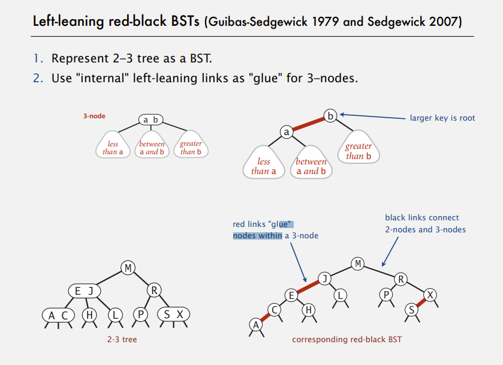
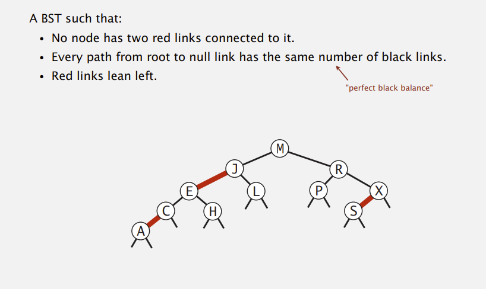
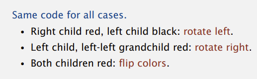
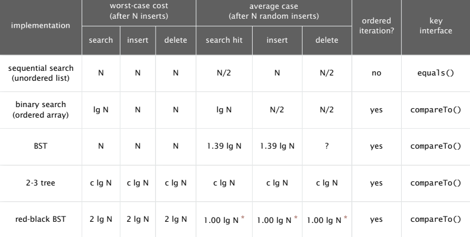

# Balanced Search Tree #

## 2-3 Tree ##

> 2-3 Tree : Allow 1 or 2 keys in a node.

> As the performance of the 2-3 search tree, it is always balanced.

## Red-Black Tree ##



- Some properties:


## Red-Black Tree Representation ##

```java
private static final boolean RED = true;
private static final boolean BLACK = false;

private class Node {
    Key key;
    Value val;
    Node left, right;
    boolean color; // color of parent link
}

private boolean isRed(Node x) {
    if (x == null) return false; // null links are black
    return x.color == RED;
}
```

## Elementary red-black BST operations ##

```java
private Node rotateLeft(Node h) {
    Node x = h.right;
    h.right = x.left;
    x.left = h;
    x.color = h.color;
    h.color = RED;
    return x;
}

private Node rotateRight(Node h) {
    Node x = h.left;
    h.left = x.right;
    x.right = h;
    x.color = h.color;
    h.color = RED;
    return x;
}

private void flipColors(Node h) {
    h.color = RED;
    h.letf.color = BLACK;
    h.right.color = BLACK;
}
```

## Red-Black BST `put()` ##



```java
private Node put(Node h, Key key, Value val) {
    if (h == null) return new Node(key, val, RED);
    int cmp = key.compareTo(h.key);
    if (cmp < 0) h.left = put(h.left, key, val);
    else if (cmp > 0) h.right = put(h.right, key, val);
    else h.val = val;

    if (isRed(h.right) && !isRed(h.left)) h = rotateLeft(h);
    if (isRed(h.left) && isRed(h.left.left)) h = rotateRight(h);
    if (isRed(h.left) && isRed(h.right)) filpColors(h);

    return h;
}
```

## ST Summary ##
