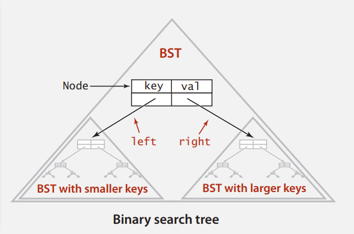
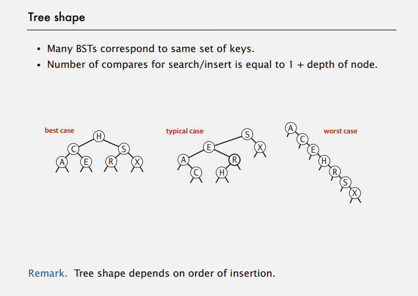
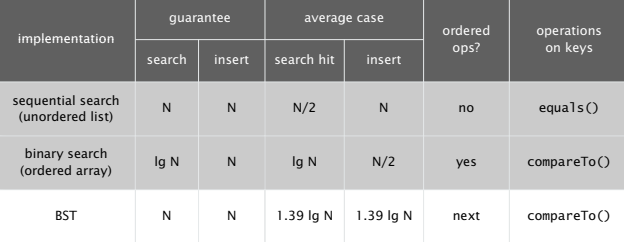
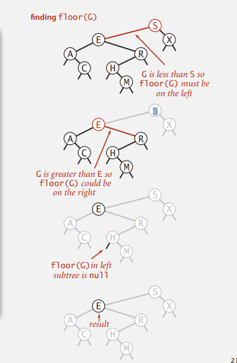
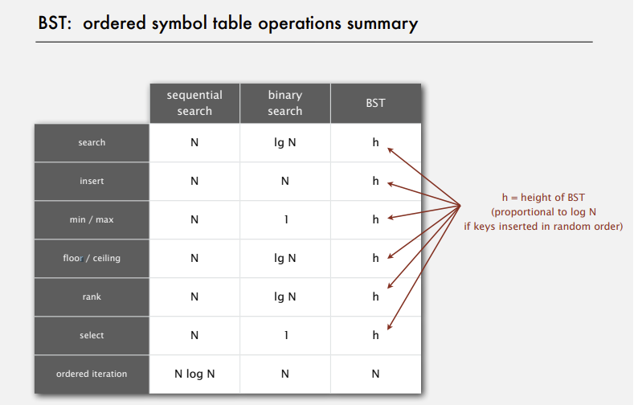
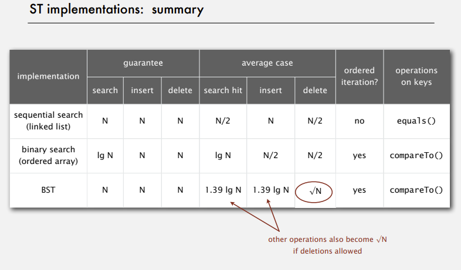

# Binary Search Tree #

## API ##
```java
public class BST<Key extends Comparable<Key>, Value> {
    private Node root;

    private class Node {
        /*See next*/
    }

    public void put(Key key, Value val);

    public Value get(Key key);

    public void delete(Key key);

    public Iterable<Key> iterator();
}
```

## The Node of the Binary Search Tree ##



```java
public class Node {
    public Key key;
    public Value val;
    public Node left, right;

    public Node(Key key, Value val) {
        this.key = key;
        this.val = val;
    }
}
```

## Search & Insert ##

> Search : If less, go left; if greater, go right; if equals, search hit.

```java
public Value get(Key key) {
    Node x = root;
    while (x != null) {
        int cmp = key.compareTo(x.key);
        if (cmp < 0) x = x.left;
        else if (cmp > 0) x = x.right;
        else return x.val;
    }
    return null;
}
```

> Insert : If less, go left; if greater, go right; if null, insert

```java
public void put(Key key, Value val) {
    root = putNode(root, key, val);
}

private Node putNode(Node x, Key key, Value val) {
    if (x == null) return new Node(key, val);
    int cmp = key.compareTo(x.key);
    if (cmp < 0) x.left = putNode(x.left, key, val);
    else if (cmp > 0) x.right = putNode(x.right, key, val);
    else x.val = val;
    return x;
}
```

## The shape of tree ##


## Time Complexity ##


## Floor & Ceiling ##

- Floor : Largest key <= a given key.
- Ceiling : Smallest key >= a given key.



```java
public Key floor(Key key) {
    Node x = reFloor(root, key);
    if (x == null) return null;
    return x.key;
}

private Node reFloor(Node x, Key key) {
    if (x == null) return null;
    int cmp = key.compareTo(x.key);
    if (cmp == 0) return x;
    if (cmp < 0) return reFloor(x.left, key);
    Node t = reFloor(x.right, key);
    if (t != null) return t;
    else return x;
}
```

- Ceiling is similar to floor

## BST Count ##

> What we do is to add an member `public int count;` in the Node to store the size of the subtree

> So `Node`, `size()`, `putNode()` should be renewed as followed.

```java
private class Node {
    public Key key;
    public Value val;
    public Node left;
    public Node right;
    public int count;

    public Node(Key key, Value val, int count) {
        this.key = key;
        this.val = val;
        this.count = count;
    }
}

public int size() {return reSize(root); }

private int reSize(Node x) {
    if (x == null) return 0;
    return x.count;
}

private Node putNode(Node x, Key key, Value val) {
    if (x == null) return new Node(key, val, 1);
    int cmp = key.compareTo(x.key);
    if (cmp < 0) x.left = putNode(x.left, key, val);
    else if (cmp > 0) x.right = putNode(x.right, key, val);
    else x.val = val;
    x.count = 1 + size(x.left) + size(x.right);
    return x;
}
```

## BST Rank ##

- Rank : How many keys < k

```java
public int rank(Key key) {
    return reRank(key, root);
}

private int reRank(Key key, Node x) {
    if (x == null) return 0;
    int cmp = key.compareTo(x.key);
    if (cmp < 0) return reRank(key, x.left);
    else if (cmp > 0) return 1 + size(x.left) + reRank(key, x.right);
    else return size(x.left);
}
```

## Inorder Traversal ##

- Traverse left subtree.
- Enqueue key.
- Tranverse right subtree.

```java
public Iterable<Key> keys() {
    Queue<Key> q = new Queue<Key>();
    inorder(root, q);
    return q;
}

private void inorder(Node x, Queue<Key> q) {
    if (x == null) return;
    inorder(x.left, q);
    q.enqueue(x.key);
    inorder(x.right, q);
}
```

## BST:ordered symbol table operations summary ##



## Deletion ##

- The implementation of `delMin()` which will be used in delete

```java
public void deleteMin() {root = delMin(root); }

private Node delMin(Node x) {
    if (x == null) return null;
    if (x.left == null) return x.right;
    x.left = delMin(x.left);
    x.count = 1 + size(x.left) + size(x.right);
    return x;
}
```

- Delete implementation :

```java
public void delete(Key key) {
    root = reDelete(root, key);
}

private Node min(Node x) {
    if (x == null) return null;
    Node reNode = x;
    while (reNode.left != null) reNode = reNode.left;
    return reNode;
}

private Node reDelete(Node x, Key key) {
    if (x == null) return null;
    int cmp = key.compareTo(x.key);
    if (cmp < 0) x.left = reDelete(x.left, key);
    if (cmp > 0) x.right = reDelete(x.right, key);
    else {
        if (x.right == null) return x.left;
        if (x.left  == null) return x.right;

        Node t = x;
        x = min(t.right);
        x.right = delMin(t.right);
        x.left = t.left;
    }
    x.count = size(x.left) + size(x.right) + 1;
    return x;
}
```

## ST Implementation Summary ##
