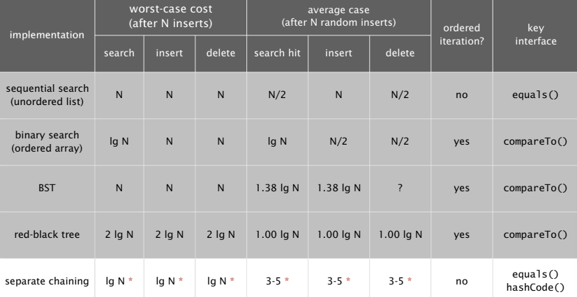
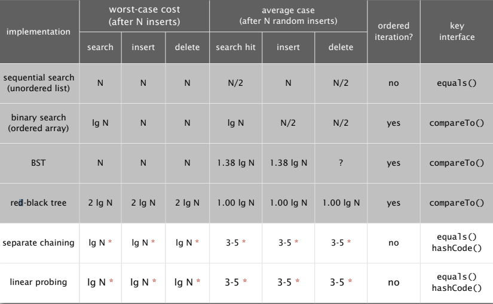

# Hash Table #

## Hash Functions ##

> Idealistic goal.
> 1.Scramble the keys uniformly to produce a table index.
> 2.Efficiently computable.
> 3.Each table index equally likely for each key.

> Requirement. If x.equals(y), then (x.hashCode() == y.hashCode()).

Some java library implementation:
```java
public final class Integer {
    private final int value;
    ...

    public int hasCode() {
        return value;
    }
}

public final class Double {
    private final double value;
    ...

    public int hashCode() {
        long bits = doubleToLongBits(value);
        return (int) (bits ^ (bits >>> 32));
    }
}

public final class Boolean {
    private final boolean value;

    ...
    public int hasCode() {
        if(value) return 1231;
        else return 1237;
    }
}

public final class String {
    private final char[] s;
    private int hash = 0;
    ...
    public int hashCode() {
        int h = hash;
        if (h != 0) return h;
        for (int i = 0 ; i < length() ; i++) {
            h = s[i] + (31 * h);
        }
        hash = h;
        return h;
    }
}
```

Modular hashing
1.Hash code. An int between -2^31 and 2^31 - 1.
2.An int between 0 and M - 1 (for use as array index).

```java
private int hash(Key key) {
    return (key.hashCode() & 0x7fffffff) % M;
}
```

## Separate Chaining ##

- Collision. Two distinct keys hashing to same index.

Implementation:
```java
public class SeparateChainingHashST<Key, Value> {
    private int M = 97;
    private Node[] st = new Node[M];

    private static class Node {
        private Object key;
        private Object val;
        private Node next;
    }

    private int hash(Key key) {
        return (key.hashCode() & 0x7fffffff) % M;
    }

    public Value get(Key key) {
        int i = hash(key);
        for (Node x = st[i]; x != null; x = x.next)
            if (key.equals(x.key)) return (Value) x.val;
        return null;
    }

    public void put(Key key, Value val) {
        int i = hash(key);
        for (Node x = st[i]; x != null; x = x.next)
            if (key.equals(x.key)) {x.val = val; return;}
        st[i] = new Node(key, val, st[i]);
    }
}
```
> Typical choice: M ~ N / 5 ⇒ constant-time ops

summary:


## Linear Probing ##

> Open addressing:When a new key collides, find next empty slot, and put it there.

1.Hash. Map key to integer i between 0 and M-1.
2.Insert. Put at table index i if free; if not try i+1, i+2, etc.

1.Hash. Map key to integer i between 0 and M-1.
2.Search. Search table index i; if occupied but no match, try i+1, i+2, etc.

implementation:
```java
public class LinearProbingHashST<Key, Value> {
    private int M = 30001;
    private Value[] vals = (Value[]) new Object[M];
    private Key[] keys = (Key[]) new Object[M];

    private int hash(Key key) {
        return (key.hashCode() & 0x7fffffff) % M;
    }

    public void put(Key key, Value val) {
        int i;
        for (i = hash(key); keys[i] != nulll; i = (i + 1) % M) {
            if (keys[i].equals(key)) break;
        }
        keys[i] = key;
        vals[i] = val;
    }

    public Value get(Key key) {
        for (int i = hash(key); keys[i] != null; i = (i + 1) % M)
            if (key.equals[keys[i]]) return vals[i];
        return null;
    }
}
```

summary:
