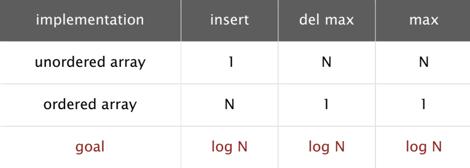
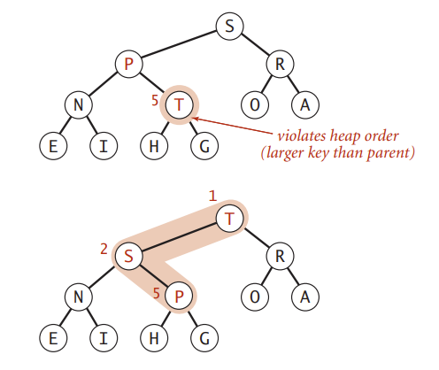
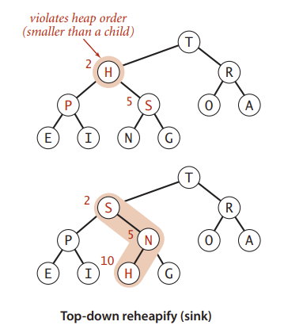
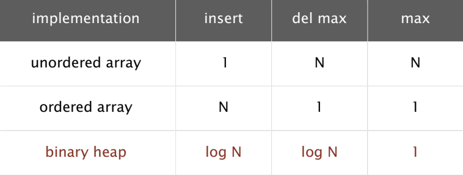
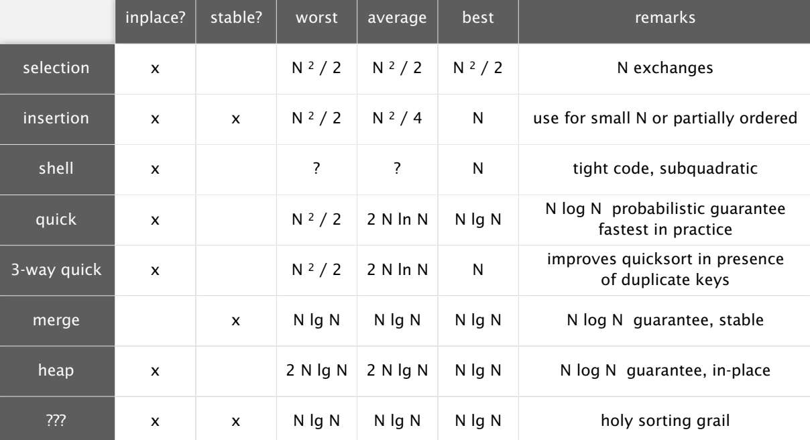

# Priority Queue #

> We use maxPQ as an example.
> The element in the Queue must be comparable.

## API of MaxPQ ##

```java
public class MaxPQ<Key extends Comparable<Key>> {
    MaxPQ(); // create an empty priority queue 

    MaxPQ(Key[] a); // create a priority queue with given keys

    void insert(Key k); // insert a key

    Key delMax(); // return and remove the max key

    boolean isEmpty(); // is the priority queue empty?

    Key max(); // return the largest key

    int size(); // return the size of the priority queue.
}
```

## Unordered Array Implementation ##

```java
public class UnorderedMaxPQ<Key extends Comparable<Key>>{
    private Key[] pq;
    private int N; // To store the size of the priority queue.

    public UnorderedMaxPQ(int capacity) {
        pq = new Comparable[capacity];
        N = 0;
    }

    public boolean isEmpty() {
        return N == 0;
    }

    public void insert(Key k) {
        pq[N++] = k;
    }

    public Key delMax() {
        int max = 0;
        for (int i = 0; i < N ; i++) {
            if (less(max, i)) max = i;
        }
        exch(pq, N-1, max);
        return pq[--N];
    }
}

```

## Ordered Array Implementation ##

```java
public class OrderedMaxPQ<Key extends Comparable<Key>> {
    private Key[] pq;
    private int N;

    public OrderedMaxPQ(int capacity) {
        pq = new Comparable[capacity];
        N = 0;
    }

    public boolean isEmpty() {
        return N == 0;
    }

    public void insert(Key k) {
        int j = N-1;
        while(j >= 0 && less(k, pq[j])) j--;
        j++;
        for (int i = N-1 ; i > j ; i--) {
            pq[i] = pq[i-1];
        }
        pq[j] = k;
        N++;
    }

    public Key delMAX() {
        return pq[--N];
    }
}
```

## Time Complexity of The Above Two Ways ##



## Binary Tree implementation ##

- Swin function demo graph

> The `insert()` method will add a key in the end of the tree.And then swim to the proper place.


- Sink function demo graph

> The `delMax()` method will use exchange the first key(which is the largest) and the last key. And sink the last key to the proper place. And return the largest key.

```java
public class BinaryTreePQ<Key extends Comparable<Key>> {

    private Key[] pq; // The index begins at 1.
    private int N;

    public BinaryTreePQ(int capacity) {
        pq = new Comparable[capacity];
        N = 0;
    }

    private void swim(int n) {
        while (n > 1 && less(n/2, n)) {
            exch(n/2, n); // pq[n / 2] is the parent of pq[n]
            n = n / 2;
        }
    }

    public void insert(Key k) {
        pq[++N] = k;
        swim(N);
    }

    private void sink (int n) {
        while (2 * n <= N) {
            int j = 2 * n;
            if (j < N && less(j, j + 1)) j++; // Choose the bigger child.
            if (!less(n, j)) break;
            exch(n, j);
            n = j;
        }
    }

    public Key delMax() {
        Key max = pq[1];
        exch(1, N--);
        sink(1);
        pq[N + 1] = null;
        return max;
    }

    public boolean isEmpty() {return N == 0; }
}

```

## Time Complexity of Binary Tree ##


## Heap Sort ##

> Heap Sort: Create max-heap with all N keys.
> Repeatedly remove the maximum key.

```java
public class Heap {
    public static void sort(Comparable[] a) {
        int N = a.length;
        for (int k = N / 2 ; k >= 1; k--) sink(a, k, N);
        while (N > 1)
        {
            exch(a, 1, N);
            sink(a, 1, --N); // The third argument of sink() is the size of the priority queue.
        }
    }
}
```

- Heap Sort in C
```c
void sink(int a[], int k, int hi)
{
    while (2 * k <= hi) {
        int j = 2 * k;
        if (j < hi && a[j] < a[j + 1]) j++;
        if (!(a[k] < a[j])) break;
        int temp = a[k];
        a[k] = a[j];
        a[j] = temp;
        k =j;
    }
}

void sort(int a[], int len) {
    for (int i = (len - 1) / 2 ; i >= 1 ; i--) sink(a, i, len - 1);
    int k = len - 1;
    while (k > 1) {
        int temp = a[1];
        a[1] = a[k];
        a[k] = temp;
        sink(a, 1, --k);
    }
    int i;
    for (i = 0 ; i < len - 1 ; i++) {
        if (a[0] < a[i]) break;
    }
    i--;
    int v = a[0];
    for (int k = 0 ; k < i ; k++) {
        a[k] = a[k + 1];
    }
    a[i] = v;
}
```

- All sort method

