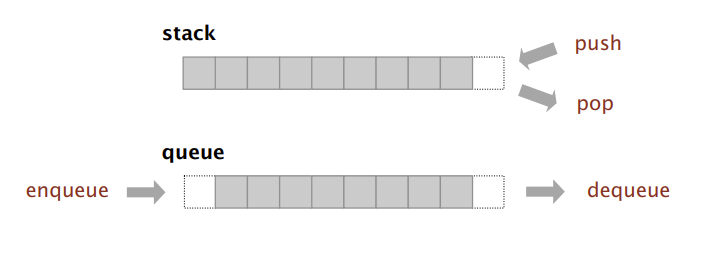

# Stack & Queue #

## Basic Concepts ##

> Stack : Examine the item most recently added.(Which means first in last out."FILO")
> Queue : Examine the item least recently added. (Which means first in first out."FIFO")



## API & Constructor ##

> I prefer the implement with linked list. So the stack and queue will be code with linked list.

### API of Stack ###
```java
import java.util.Iterator;

public class Stack<Item>  implements Iterable<Item>{

    private Node first;
    private int size;

    private class Node {
        Item item;
        Node next;
    }

    public Stack() {
        first = null;
        size = 0;
    }

    public boolean isEmpty() {}

    public void push(Item item) {}

    public Item pop() {}

    public int size() {}

    public Iterator<Item> iterator() {}
}
```

### API of Queue ###
```java
import java.util.Iterator;

public class Queue<Item>  implements Iterable<Item>{

    private Node first;
    private Node last;
    private int size;

    private class Node {
        Item item;
        Node next;
    }

    public Queue() {
        first = null;
        last = null;
        size = 0;
    }

    public void enqueue(Item item) {}

    public Item dequeue() {}

    public boolean isEmpty() {}

    public int size() {}

    public Iterator<Item> iterator() {}
}
```

## `size()` & `isEmpty()` ##

> Because we use `int size` to save the size of the stack or queue. So the implement of the two function is as follow.

```java
public int size() {return size; }

public boolean isEmpty() {return size == 0; }

```

## `push()` & `enqueue` ## 

> `push()` will add an item in the first of the linked list. So the inplement is as follow.

```java
public void push(Item item) {
    if (item == null) throw new IllegalArgumentException();
    Node newNode = new Node();
    newNode.next = first;
    newNode.item = item;
    first = newNode;
    size++;
}
```

> But `enqueue()` will not be so easy, because we should add the item in the last of the item.Don't forget to judge whether the `Node last` is null.

```java
public void enqueu(Item item) {
    if (item == null) throw new IllegalArgumentException();
    Node newNode = new Node();
    newNode.next = null;
    newNode.item = item;
    if (last == null) {
        last = newNode;
        first = newNode;
    } else {
        last.next = newNode;
        last = newNode;
    }
    size++;
}
```

## `pop()` & `dequeue()` ##

> In the two data structures, what `pop()` and `dequeue()` is the same which is remove the item in the first node and return it. But in the `dequeue()`, we should judge whether the queue is empty.If it's empty, the last must be renewed as null.

```java
public Item pop() {
    if (isEmpty()) throw new java.util.NoSuchElementException();
    Item reItem = first.item;
    first = first.next;
    size--;
    return reItem;
}
```

```java
public Item dequeue() {
    if (isEmpty()) throw new java.util.NoSuchElementException();
    Item reItem = first.item;
    first = first.next;
    size--;
    if (first == null) last = null;
    return reItem;
}
```

## Iterable ##

> Stack and queue are both iterable which have a method called `iterator()`.This method will return a iterator of all the elements.

> The implementation is as follow. (Two data structure are the same.)

```java
public Iterator<Item> iterator() {
    return new ListIterator();
}

private class ListIterator implements Iterator<Item> {
    private Node current = first;

    public boolean hasNext() {
        return current != null;
    }

    public void remove() {
        throw new UnsupportedOperationException();
    }

    public Item next() {
        Item reItem = current.item;
        current = current.next;
        return reItem;
    }
}
```

## Implementation Summary ##

- Stack

```java
import java.util.Iterator;

public class Stack<Item>  implements Iterable<Item>{

    private Node first;
    private int size;

    private class Node {
        Item item;
        Node next;
    }

    public Stack() {
        first = null;
        size = 0;
    }

    public boolean isEmpty() {
        return size == 0;
    }

    public void push(Item item) {
        if (item == null) throw new IllegalArgumentException();
        Node newNode = new Node();
        newNode.item = item;
        newNode.next = first;
        first = newNode;
        size++;
    }

    public Item pop() {
        if (isEmpty()) throw new java.util.NoSuchElementException();
        Item reItem = first.item;
        first = first.next;
        size--;
        return reItem;
    }

    public int size() {
        return size;
    }

    public Iterator<Item> iterator() {
        return new ListIterator();
    }

    private class ListIterator implements Iterator<Item> {
        private Node current = first;

        public boolean hasNext() {
            return current != null;
        }

        public void remove() {
            throw new UnsupportedOperationException();
        }

        public Item next() {
            Item reItem = current.item;
            current = current.next;
            return reItem;
        }
    }
}
```

- Queue

```java
import java.util.Iterator;

public class Queue<Item>  implements Iterable<Item>{

    private Node first;
    private Node last;
    private int size;

    private class Node {
        Item item;
        Node next;
    }

    public Queue() {
        first = null;
        last = null;
        size = 0;
    }

    public void enqueue(Item item) {
        if (item == null) throw new IllegalArgumentException();
        Node newNode = new Node();
        newNode.item = item;
        newNode.next = null;
        if(last == null) {
            last = newNode;
            first = newNode;
        } else {
            last.next = newNode;
            last = newNode;
        }
        size++;
    }

    public Item dequeue() {
        if (isEmpty()) throw new java.util.NoSuchElementException();
        Item reItem = first.item;
        first = first.next;
        if (first == null) last = null;
        size--;
        return reItem;
    }

    public boolean isEmpty() {
        return size == 0;
    }

    public int size() {
        return size;
    }

    public Iterator<Item> iterator() {
        return new ListIterator();
    }

    private class ListIterator implements Iterator<Item> {
        private Node current = first;

        public boolean hasNext() {
            return current != null;
        }

        public void remove() {
            throw new UnsupportedOperationException();
        }

        public Item next() {
            Item reItem = current.item;
            current = current.next;
            return reItem;
        }
    }
}
```
