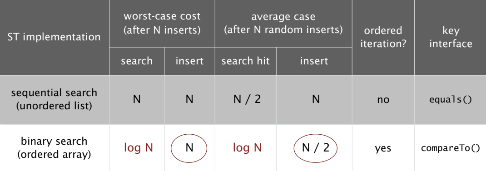
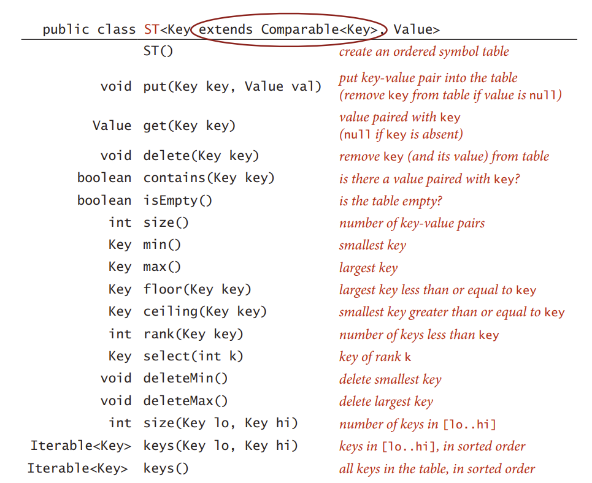

# Symbol Table #

## API ##

```java
public class ST<Key, Value> {

    ST(); // create a symbol table

    void put(Key key, Value val); // put key-value pair into the table
                                  // (remove key from table if value is null)

    Vlue get(Key key); // value paired with key
                       // (null if key is absent)

    void delete(Key key); // remove key (and its value) from the table.

    boolean contains(Key key); // is there a value paired with key?
    boolean isEmpty() ; // is the table empty?

    int size(); // number of key-value pairs in the table

    Iterable<Key> keys(); // all the keys in the table
}
```

## `contains()` & `delete()` ##

```java
public boolean contains(Key key) {
    return get(key) != null; 
}

public void delete(Key key) {
    put(key, null);
}
```

## Elementary Implementation ##

- Using linked list

> There are two different ways: ordered and unordered ways. 

- unordered:
```java
import java.util.Stack;
public class ST<Key, Value> {

    private Node first;
    private int size;

    private class Node {
        Key key;
        Value val;
        Node next;
        Node last;
    }

    public ST(){
        first = null;
        size = 0;
    }

    public void put(Key key, Value val) {
        if (val != null) {
            Node newNode = new Node();
            newNode.key = key;
            newNode.val = val;
            newNode.next = first;
            newNode.last = null;
            if (first != null) first.last = newNode;
            first = newNode;
            size++;
        } else { // remove the key
            Node current = first;
            if (contains(key)) {
                while (current != null && current.key != key) current = current.next;
                if (current.next != null) current.next.last = current.last;
                if (current.last != null) current.last.next = current.next; 
                else first = first.next;
                size--;
            }
        }
    }

    public Vlue get(Key key); {
        Node current = first;
        while (current != null && current.key != key) current = current.next;
        if (current == null) return null;
        else return current.val;
    } 

    public void delete(Key key) {
        put(key, null);
    }

    public boolean contains(Key key) {
        return get(key) != null;
    }
    public boolean isEmpty() {
        return size == 0;
    }

    public int size() {
        return size;
    }

    public Iterable<Key> keys() {
        Stack<Key> myStack = new Stack<Key>();
        Node current = first;
        while (current != null) myStack.push(current.key);
        return myStack;
    }
}
```

- Ordered implementation use array to implement and use binary search to get the value.The implementation will be **omited**.

- Time Complexity:


- Ordered symbol table API:


