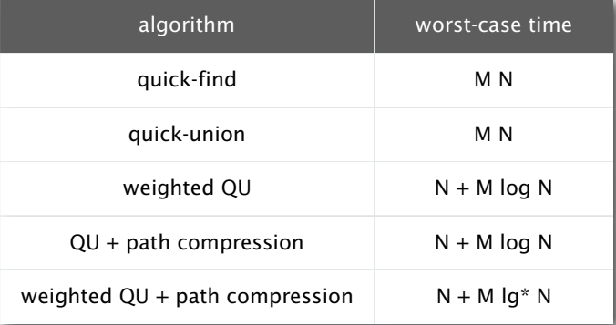

# Union-Find #

## API & Constructor ##

```java
public class UF {

    private int[] id; 
    private int[] si; 

    public UF (int N) {
        id = new int[N];
        si = new int[N];
        for (int i = 0; i < N ; i++) {
            id[i] = i;
            si[i] = 1;
        }
    }

    private int root(int p) {} 

    public boolean connected(int p, int q) {}

    public void union(int p, int q) {}
}
```

> The array id[] is used to indicate the index of its parent.
> The array si[] is used to indicate the size of the tree(or subtree which has node i be the root.) so that the forest can be construst more efficent.

> The `root()` is used to get the root of the node.

## Connected Function ## 

> If two node is connected, they will have the same root.
> So the function `connected()` is as follow:

```java
public boolean connected(int p, int q) {
    return root(p) == root(q);
}
```

> If a node is a root, its parent will be itself. So `root()` is as follow.

```java
private int root(int i) {
    while (id[i] != i) {
        id[i] = id[id[i]]; //**
        i = id[i];
    }
    return i;
}
```

> The line which has "**" is used to make the parent of the node become its grandparent, so that the search process will be faster.(path compression)

## Union Function ##

> The principle of union is to make the two node have the same root.But if we randomly determin the final root, the height of the tree may be much higher which makes the find more consuming.

> The solution is that we link the root of smaller tree to the root of the larger tree.(weighted QU)

```java
public void union(int p, int q) {
    int i = root(p);
    int j = root(q);
    if (i == j) return;
    if (si[i] < si[j]) {id[i] = j; si[j] += si[i]; }
    else {id[j] = i; si[i] += si[j]; }
}
```

## Time Analysis ##

> The time used is as followed (The code I write is the "weighted QU + path compression" which is the most efficient.)




##  Implementation Summary ## 

```java
public class UF {
    private int[] id;
    private int[] si;

    public UF(int N) {
        id = new int[N];
        si = new int[N];
        for (int i = 0; i < N ; i++) {
            id[i] = i;
            si[i] = 1;
        }
    }

    private int root(int i) {
        while (id[i] != i) {
            id[i] = id[id[i]];
            i = id[i];
        }
        return i;
    }

    public boolean connected(int p, int q) {
        return root(p) == root(q);
    }

    public void union(int p, int q) {
        int i = root(p);
        int j = root(q);
        if (i == j) return;
        if (si[i] < si[j]) {id[i] = j; si[j] += si[i]; }
        else {id[j] = i; si[i] += si[j]; }
    }
}
```